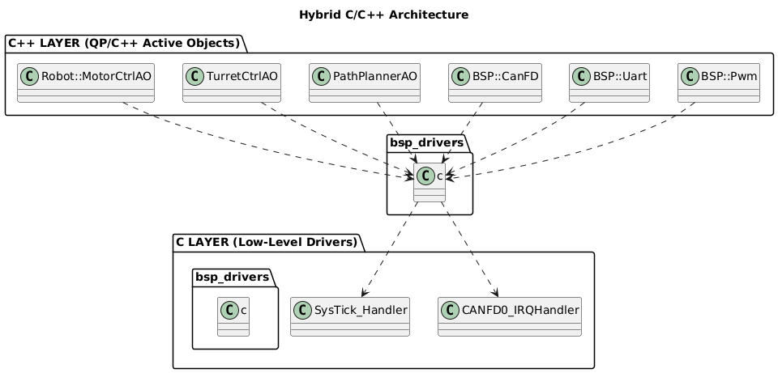
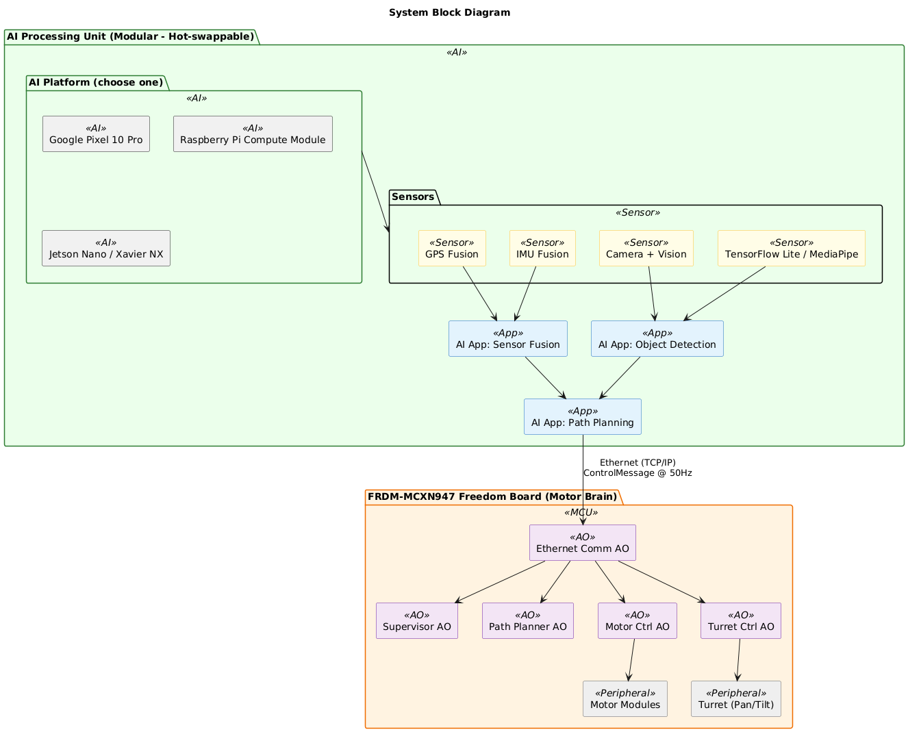
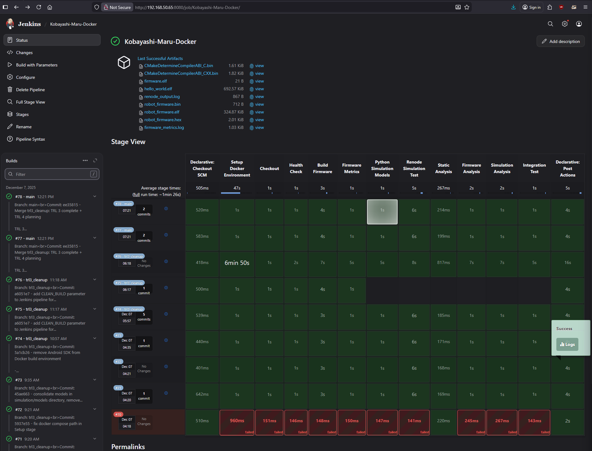

<div align="center">

# 🤖 Kobayashi Maru
## Heavy Duty 4WD Robot Platform

[](docs/TRL2_VALIDATION_CHECKLIST.md)
[](LICENSE)
[](https://www.nxp.com/products/processors-and-microcontrollers/arm-microcontrollers/general-purpose-mcus/mcx-arm-cortex-m/mcx-n-series-microcontrollers/mcx-n94x-and-n54x-mcus-with-dual-core-arm-cortex-m33-edgelock-secure-subsystem-and-neural-processing-unit:MCX-N94X-N54X)
[](https://www.state-machine.com/qpcpp/)

**🎯 Technology Readiness Level:** TRL 2 Complete  
**✅ Status:** Concept validated through simulation  
**🔧 Current State:** Architecture defined • Firmware operational in Renode • CI/CD established  
**🚀 Next Milestone:** TRL 3 component validation on physical hardware

[Documentation](docs/) • [Architecture](docs/ARCHITECTURE.md) • [TRL Status](docs/TRL2_VALIDATION_CHECKLIST.md)

</div>

---

## 📋 Project Overview

Heavy-duty autonomous 4WD robot platform with modular AI architecture:

- 🧠 **Modular AI processing unit** (Pixel 10 Pro, Raspberry Pi, or Jetson)
- 🛰️ **GPS navigation** and sensor fusion
- 👁️ **Vision processing** with TensorFlow Lite
- 🗺️ **Path planning** (A*/RRT algorithms)
- 🎯 **Pan/tilt turret** for camera/sensor pointing
- 🌐 **Ethernet communication** for platform-independent control
- 🚌 **CAN-FD communication** between motor modules
- 🖥️ **Renode simulation** for development and testing
- ⚡ **Quantum QP/C++ Framework** for real-time middleware

## 🏗️ Hybrid C/C++ Architecture

The firmware uses a recommended hybrid approach common in embedded systems:

| Language | Usage |
|:---------|:------|
| **C++** | MCU modules (QP framework), middleware integration, turret control, high-level motion control, vision + path planning on Pixel 10 Pro |
| **C** | Low-level drivers, ISRs, performance-critical routines |

**Architecture Layers:**




*Source: [assets/diagrams/architecture_layers.puml](assets/diagrams/architecture_layers.puml)*

<div style="page-break-after: always;"></div>

## 🔧 System Architecture

> **💡 Modular Design:** Ethernet-based communication allows swapping AI processing units (Pixel 10 Pro, Raspberry Pi, Jetson Nano, etc.) without firmware changes. Standard TCP/IP protocol provides platform independence.


**System Block Diagram:**



*Source: [assets/diagrams/system_block_diagram.puml](assets/diagrams/system_block_diagram.puml)*

For detailed architecture documentation, see [docs/ARCHITECTURE.md](docs/ARCHITECTURE.md).

## 📁 Project Structure

```
kobayashi_maru/
├── firmware/               # Embedded firmware for FRDM-MCXN947
│   ├── src/
│   │   ├── bsp/           # Board Support Package
│   │   ├── drivers/       # Hardware drivers
│   │   ├── subsystems/    # Robot subsystem modules
│   │   ├── qp_app/        # QP Active Objects
│   │   └── main.c         # Application entry point
│   ├── include/           # Header files
│   └── config/            # Configuration files
├── simulation/            # Renode simulation files
│   ├── renode/            # Platform descriptions and scripts
│   └── models/            # Python peripheral models
├── docs/                  # Documentation
│   └── ARCHITECTURE.md    # System architecture details
└── tests/                 # Test files

Note: AI unit applications are developed separately and communicate
via Ethernet TCP/IP (see docs/ARCHITECTURE.md for protocol details)
```

<div style="page-break-after: always;"></div>

## 🔌 Hardware Requirements

### FRDM-MCXN947 Freedom Board

**Processor:** Dual Arm Cortex-M33 @ 150 MHz

**Memory:** 2 MB Flash, 512 KB RAM

**Key Features:**
- Ethernet 10/100 (or external PHY module)
- 2x CAN-FD controllers
- Multiple FlexComm (UART, SPI, I2C)
- FlexPWM for servo control

### AI Processing Unit (Modular - Choose One)


#### Option 1: Google Pixel 10 Pro *(Current)*

| Feature | Specification |
|:--------|:--------------|
| **Processor** | Tensor G4 chip with on-device AI acceleration |
| **AI Framework** | TensorFlow Lite / MediaPipe for object detection and tracking |
| **Sensors** | GPS + IMU with 9-axis sensor fusion |
| **Camera** | 50 MP with vision processing |
| **Connectivity** | USB-C to Ethernet adapter |

#### Option 2: Raspberry Pi Compute Module 5 *(Current/Future)*

| Feature | Specification |
|:--------|:--------------|
| **Processor** | ARM Cortex-A78, high-performance general processing |
| **Networking** | Built-in Gigabit Ethernet |
| **Expansion** | GPIO for additional sensors |
| **Software** | Full Linux with ROS support |
| **PCIe** | High-speed peripherals |
| **AI/ML Support** | Improved for vision and robotics workloads |
| **Cost** | ~$60-100 (vs $1000 phone) |

#### Option 3: NVIDIA Jetson Nano / Xavier NX *(Future)*

| Feature | Specification |
|:--------|:--------------|
| **GPU** | 128/384 CUDA cores for acceleration |
| **AI Framework** | TensorRT optimized inference |
| **Networking** | Built-in Gigabit Ethernet |
| **Best For** | Advanced vision AI, multiple cameras |

> **Note:** All options communicate via standard Ethernet TCP/IP. No firmware changes needed to swap platforms.

**Trade-off:**
- For cutting-edge vision and sensor features, the Pixel 10 Pro may outperform the Pi CM5 due to its specialized hardware and software stack.
- For open hardware, flexibility, and community support, the Pi CM5 is a strong choice.

**Recommendation:**
- The architecture is designed to support both platforms, allowing users to select the best fit for their application. This enables flexibility for future upgrades and diverse use cases.

### Motor Modules (x4)
- Brushless DC motors with encoders
- CAN-FD enabled ESC
- Node IDs: 0x100 (FL), 0x101 (FR), 0x102 (RL), 0x103 (RR)

### Pan/Tilt Turret
- High-torque digital servos
- Pan: ±180°, Tilt: -45° to +90°
- CAN-FD Node ID: 0x200

## 🚀 Getting Started

### Prerequisites

- [Renode](https://renode.io/) - For simulation
- ARM GCC Toolchain - For firmware compilation
- AI Unit Application - Android/Python app for chosen platform
- QP/C Framework - Real-time embedded framework
- Ethernet network (100 Mbps recommended)

### Running the Simulation

```bash
# Start Renode simulation
cd simulation/renode
renode robot_simulation.resc

# Connect to AI unit terminal (in another terminal)
telnet localhost 3456
```

### Building the Firmware

```bash
cd firmware
# Build with ARM GCC (configure toolchain first)
make
```

<div style="page-break-after: always;"></div>

## 📡 Communication Protocol

**Ethernet-Based Protocol:** TCP for reliable control commands, UDP for high-frequency sensor data. Platform-independent (works with any device supporting TCP/IP).

#### AI Unit → MCXN947 (Control Messages - TCP)

```cpp
struct ControlMessage {  // 32 bytes total
    uint8_t msg_type;           // 1=GPS, 2=TARGET, 3=CMD, 4=IMU
    uint8_t reserved[3];        // Alignment
    float target_x, target_y;   // Vision: Target position (meters)
    float target_distance;      // Vision: Range to target (meters)
    float heading;              // IMU: Robot orientation (degrees)
    float gps_lat, gps_lon;     // GPS: Current position
    uint8_t command;            // STOP=0, GO=1, FIRE=2, AUTO=3
    uint8_t target_class;       // Object class ID (0-255)
    uint16_t confidence;        // Detection confidence (0-1000)
}; // Sent at 50 Hz = 1.6 KB/s
```

#### MCXN947 → AI Unit (Status Messages - UDP)

```cpp
struct StatusMessage {  // 24 bytes total
    uint8_t msg_type;           // STATUS=1, ACK=2, ERROR=3
    uint8_t robot_state;        // IDLE=0, MANUAL=1, AUTO=2, EMERGENCY=3
    uint16_t battery_mv;        // Battery voltage (millivolts)
    float position_x, position_y;  // Odometry position (meters)
    float velocity;             // Current speed (m/s)
    uint32_t error_flags;       // Error bitfield
    uint32_t timestamp_ms;      // Milliseconds since boot
}; // Sent at 20 Hz = 480 bytes/s
```

**Network Configuration:**

| Device | IP Address | Protocol | Purpose |
|:-------|:-----------|:---------|:--------|
| AI Unit | 192.168.1.100:5000 | TCP Server | Control commands |
| MCXN947 | 192.168.1.10:5001 | UDP | Status broadcasts |

<div style="page-break-after: always;"></div>

## ⚙️ QP Framework Active Objects

### Hardware Interrupts (Highest Priority)

**Emergency Stop GPIO:** 1-2 μs response (interrupt latency: ~60-100 cycles @ 150 MHz)
- Immediately disables motors
- Hardware-level safety mechanism

### Active Objects (Software Priorities)

| Active Object | Priority | Function |
|:--------------|:--------:|:---------|
| **Supervisor** | 7 | System state machine, safety coordination, heartbeat monitoring |
| **MotorCtrl** | 6 | 4WD motor control via CAN-FD @ 1 kHz (time-critical) |
| **TurretCtrl** | 5 | Pan/tilt servo control, target tracking |
| **EthernetComm** | 4 | TCP/UDP communication with AI unit (platform-agnostic) |
| **SensorFusion** | 3 | Local sensor processing, position estimation |
| **PathPlanner** | 2 | Local obstacle avoidance, waypoint tracking |

**Priority Rationale:** Motor control and turret positioning require real-time guarantees, while network I/O runs at lower priority to prevent jitter in control loops.

**Note:** High-level sensor fusion and AI processing handled on external AI unit.

## 🛠️ Continuous Integration

Automated builds and tests are managed via Jenkins. The pipeline ensures code quality, successful builds, and hardware-in-the-loop simulation before merging changes.



*Source: Jenkins CI/CD pipeline for Kobayashi Maru project*

## 📄 License

This project is licensed under the GNU General Public License v3.0 - see the [LICENSE](LICENSE) file for details.

---

<div align="center">

**Built with ❤️ for autonomous robotics**

[⭐ Star this repo](https://github.com/mhouse1/kobayashi_maru) • [🐛 Report Bug](https://github.com/mhouse1/kobayashi_maru/issues) • [💡 Request Feature](https://github.com/mhouse1/kobayashi_maru/issues)

</div>
